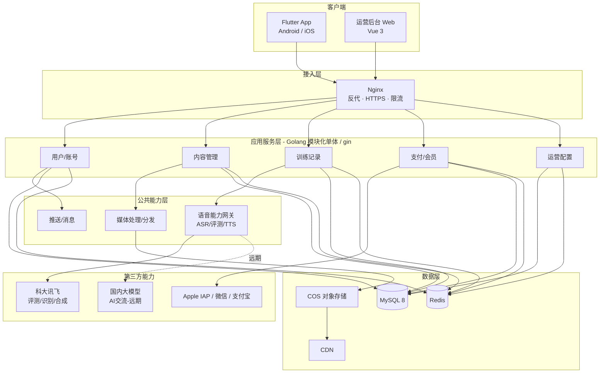

# EchoTalk（影子跟读）技术方案

| 项目 | 内容 |
|---|---|
| 项目名称 | EchoTalk / 影子跟读 |
| 文档类型 | 技术方案（v1，更新版） |
| 适用阶段 | MVP 立项与首版（v1）研发 |
| 目标平台 | Android、iOS（v1）；HarmonyOS（远期）|
| 目标市场 | 国内为主 |
| 开发模式 | 单人开发 |
| 编制说明 | 本方案已落实各项选型决策：Flutter 单端、Golang 模块化单体 + gin、MySQL 8、Vue 3 管理端、轻量多仓、第三方语音能力（科大讯飞优先）、双通道支付、AI 交流后期迭代 |

> 更新要点：相比初版，本版落定了数据库（MySQL）、后台框架（gin）、管理端框架（Vue 3 + Element Plus）、仓库形式（轻量多仓）四项决策，并将「部署与运维」整节重写为贴合单台 2 核 2G 服务器现状的精简方案。
>
> 说明：模块级详细功能与交互需在各模块开发前再次沟通确认；本方案聚焦技术架构、选型依据、模块实现要点、合规与风险，作为研发与排期的总纲。

---

## 1. 项目定位与范围

EchoTalk 是一款面向全年龄段英语学习者的移动端应用，以「跟读—发音—交流」为核心训练路径，结合语音评测与 AI 能力，提升用户的听力辨识、发音准确度与口语表达能力。配套一个 Web 运营管理后台，用于视频、文章、发音素材等内容的录入、配置与上下架。

**v1 范围**：影子跟读、发音练习、文章跟读、账号体系、支付与会员、运营后台（内容配置）。
**远期范围**：AI 交流（v2）、HarmonyOS 客户端（v1.x）。
**开发模式**：单人开发，故 v1 应优先保证「影子跟读 / 发音练习 / 文章跟读」三大核心训练功能，其余可分阶段推进。

---

## 2. 整体技术架构

采用「客户端 + 后台模块化单体 + 第三方能力」的分层架构。核心设计原则：**MVP 阶段不过度拆分微服务；把语音、支付等易变/易绑定的外部能力收敛到独立的网关层，便于后续替换与扩展。**

### 2.1 架构分层

| 层 | 组成 | 技术 |
|---|---|---|
| 客户端层 | App（Android / iOS）、运营后台（Web） | Flutter；后台 Web 用 Vue 3 + Element Plus |
| 接入层 | 反向代理、HTTPS、鉴权、限流 | Nginx |
| 应用服务层 | 用户、内容、训练、支付、运营等业务模块 | Golang 模块化单体（gin + 分层） |
| 公共能力层 | 语音能力网关、媒体处理、推送、配置 | Golang + 第三方 SDK |
| 数据层 | 关系库、缓存、对象存储、CDN | MySQL 8、Redis、腾讯云 COS、CDN |
| 第三方能力 | 语音评测/识别/合成、大模型、支付、推送 | 科大讯飞、国内大模型、Apple IAP / 微信 / 支付宝 |

### 2.2 架构示意（mermaid）

---

## 3. 技术选型说明

### 3.1 客户端：Flutter（Android + iOS 单一代码库）

- **结论**：v1 用 Flutter 一套代码覆盖 Android 与 iOS。
- **依据**：单人开发，一套代码覆盖双端是最大的人力节省；本应用重录音、音频波形、变速播放与动画，Flutter 自绘引擎在这些场景表现优秀且插件成熟。
- **鸿蒙留路**：HarmonyOS 为远期目标，Flutter 有社区版（Flutter-OH）适配路径，届时再评估「Flutter-OH 适配」或「单独 ArkUI 版本」，不影响 v1。
- **关键三方库（参考）**：播放 `video_player` / `better_player`（HLS）；音频/变速 `just_audio`（`setSpeed` 变速不变调）；录音 `record`；波形 `audio_waveforms`；语音评测需为讯飞原生 SDK 写一层 `platform channel` 封装（一次性工作量）。

### 3.2 后台：Golang 模块化单体 + gin

- **结论**：模块化单体起步，框架用 **gin + 清晰分层**，按业务边界清晰分包，后期按需再拆。
- **依据**：明确不做微服务，go-zero 的核心价值（rpc、服务发现等微服务机制）现阶段用不上；gin 最简单、社区最大，**单人开发与日后外包都最易把控**，避免重框架的黑盒抽象增加维护与审查成本。
- **配套库（参考）**：配置 `viper`、数据访问 `GORM` 或 `sqlc`、日志 `zap`、参数校验 `validator`。
- **模块边界**：`user` / `content` / `training` / `payment` / `ops`，以及公共能力 `speech`（语音能力网关）。模块以清晰接口与独立数据表边界划分，为后续按模块拆微服务保留空间。

### 3.3 数据库与缓存：MySQL 8 + Redis

- **结论**：关系库用 **MySQL 8**，缓存用 Redis。
- **依据**：数据模型（用户、内容、订单、训练记录）是标准关系型，用不到 PostgreSQL 在 JSONB/地理/复杂分析上的强项；MySQL 国内生态最成熟、资料与运维支持最多、轻量机器调优文档最全。后续若出现重度 JSON 存储或复杂统计分析，再评估 PostgreSQL。

### 3.4 管理端：Vue 3 + Element Plus

- **结论**：运营后台用 **Vue 3 + Element Plus**，基于成熟开源 admin 模板（如 vue-pure-admin / vben-admin）起步。
- **依据**：运营后台是内部 CRUD 工具，目标是快、省、好维护；Vue + Element Plus 是国内中后台事实标准，现成模板能省掉大量脚手架，单人开发可直接在模板上填业务。React + Ant Design 同样可选，若更熟 React 可换。App（Flutter）与管理端无技术复用关系，可独立按「上手快 + 模板多」选择。

### 3.5 语音能力：采购（科大讯飞优先）

- 发音评测、语音识别（ASR）、语音合成（TTS）一站式优先用科大讯飞，腾讯云为备选；建议选型阶段做录音+评测 POC 对比后最终敲定。
- 自研发音评测属研究级工程，不在 MVP 范围。
- 通过自建「语音能力网关」统一封装，屏蔽厂商差异，便于换厂商与成本统计。

### 3.6 AI 交流：国内大模型（远期 v2）

- 语音对话链路：STT → 大模型 → TTS，或采用支持实时语音的方案。
- 候选：豆包 / 通义 / DeepSeek 等，到迭代时再定。

### 3.7 支付：双通道

- iOS：Apple 应用内购买（StoreKit / IAP），订阅 + 内购。
- Android（国内应用商店）：微信支付 + 支付宝。
- 详见第 8 章合规说明。

### 3.8 仓库形式：轻量多仓

- **结论**：采用**轻量多仓**——`backend`（Go）、`app`（Flutter）、`admin`（Vue）三个独立仓库，各自一份聚焦的 CLAUDE.md，前后端接口用一份 OpenAPI 文档对齐。
- **依据**：三套栈完全异构、**不共享代码**，发布节奏各异（App 过商店审核、后端持续部署、管理端独立部署）；多仓使工具链/依赖互不污染、上下文干净（利于 AI 协作），且 App 迟早需独立仓。单人开发下，多仓的主要成本仅是目录切换与改接口时两次提交，开销很小。
- **备选**：若更偏好「一个仓全看见、少切换」，可用单仓 + `backend/ app/ admin/` 三子目录。因三套栈零共享，两种形式互转成本极低，可按个人习惯选择，非单向门。

---

## 4. 核心功能模块技术方案

### 4.1 影子跟读（Shadow Reading）

- **内容生产**：运营后台上传英文视频 → 转码为 HLS 多码率 → 存 COS → CDN 分发；为每个视频生成句级数据（每句含起止时间戳、英文文本、可选中文翻译/音标）。断句可由 ASR 自动生成后人工校对，或纯人工配置。
- **播放与跟读**：客户端按句定位/循环播放原声；用户对当前句录音。
- **评测闭环**：用户录音 → 经语音能力网关送讯飞评测 → 返回总分及发音、流利度、完整度、单词级评分 → 客户端展示评分并支持「原声 vs 用户录音」对照回放。
- **数据沉淀**：逐句得分、整段完成度、历史成绩落库，供复习与进度追踪。

### 4.2 发音练习（Pronunciation Practice）

- **内容**：音标库（单音标 / 组合音标 / 连读规则）+ 每条标准发音音频 + 口型/舌位图（静态图或动画）；运营后台可配置与排序。
- **练习闭环**：用户录音 → 评测 SDK 对单音/单词打分 → 给出对比与建议 → 记录掌握度。
- **学习路径**：按元音/辅音/连读等维度分类，支持由易到难。

### 4.3 文章跟读（Article Reading）

- **内容**：经典英文文章库（难度/分类标签）+ 配套音频（真人或 TTS 合成）+ 句级时间戳。
- **变速播放**：变速不变调（`just_audio` setSpeed 保持音调）。
- **跟读闭环**：支持整篇与分段跟读，跟读时高亮当前句/词，录音后给出评分与对照回放。
- **学习辅助**：收藏、断点续读、生词标记/生词本。

### 4.4 AI 交流（AI Conversation，v2 远期）

- **链路**：用户语音 → STT → 大模型生成回复 → TTS 播放。
- **能力**：话题/场景选择（日常、出行、面试等）与难度分级；保存对话记录；对话后给出语法、用词、发音的纠错与建议。

### 4.5 账号体系（Account & Login）

- 邮箱 / 手机号注册登录，含验证码、密码设置与找回。
- iOS 上架注意：若提供第三方社交登录，App Store 要求同时提供 Apple 登录；建议在设计阶段评估是否引入第三方登录。
- 个人中心承载学习记录、收藏、会员状态等；提供账号注销、隐私协议同意。
- 鉴权：JWT / OAuth2，含 token 刷新机制。

### 4.6 支付与会员（Payment & Membership）

- **商业模式**：免费/付费内容边界配置化（哪些视频、文章、评测/AI 次数受限）；订阅制与内容包可组合。
- **双通道**：iOS 走 IAP；Android 走微信/支付宝。
- **服务端**：订单系统、会员状态同步、续费与到期处理、退款流程、对账；服务端票据校验（Apple 收据验证、微信/支付宝回调验签）。

---

## 5. 公共能力与基础设施

- **语音能力网关**：统一封装 ASR / 评测 / TTS，对上层提供稳定接口；负责厂商鉴权、限流、调用计费统计、结果缓存（TTS 合成结果缓存可显著降本）、以及厂商不可用时的降级。**禁止各业务模块直接耦合讯飞 SDK。**
- **媒体处理与分发**：上传、转码（HLS）、存储、CDN 加速、防盗链；视频预加载与码率自适应策略。
- **推送/消息**：学习提醒、打卡、营销触达（接入国内推送通道，注意各厂商通道差异）。
- **配置中心**：免费/付费边界、内容上下架、价格、功能开关的集中配置。

---

## 6. 数据架构（主要实体概览）

| 域 | 主要实体 |
|---|---|
| 用户与账号 | 用户、第三方账号绑定、登录凭证 |
| 会员与交易 | 会员/订阅、订单、支付流水、退款 |
| 内容 | 视频、视频句子（字幕/时间戳）、文章、文章段落/句子、音标条目 |
| 训练 | 跟读记录、评测明细（句级/词级）、发音练习记录 |
| 学习辅助 | 收藏、生词本、打卡/学习时长 |
| 运营 | 分类、标签、内容上下架状态、价格配置 |
| AI（远期） | 对话会话、对话消息 |

> 设计建议：跨模块的学习时长、连续打卡、成绩曲线、收藏与生词本统一沉淀到「学习数据中心」，支撑用户成长体系与留存。

---

## 7. 后台服务划分（模块化单体内部边界）

- **用户/账号模块**：注册登录、鉴权、个人中心、账号注销。
- **内容管理模块**：视频/文章/音标的存储、句级数据、上下架。
- **训练记录模块**：跟读/发音/文章的成绩与进度、收藏、生词本、打卡。
- **支付/会员模块**：订单、会员状态、双通道支付、对账。
- **运营配置模块**：分类标签、价格、功能开关、内容审核流转。
- **语音能力网关**（公共能力）：评测/识别/合成的统一出口。

各模块以清晰接口与独立数据表边界划分，为后续按模块拆分微服务保留空间。

---

## 8. 安全与合规（国内重点）

### 8.1 支付合规（关键约束）

- iOS 端付费解锁数字内容**必须使用 Apple IAP**，不能接微信/支付宝，否则上架审核会被拒；中国区 App Store 至今仍强制 IAP 且为 iOS 唯一应用入口。
- 自 2026 年 3 月 15 日起，中国区标准佣金由 30% 降至 25%，小企业及订阅首年后由 15% 降至 12%。**定价需把 iOS 抽成计入，并申请 Small Business Program 争取 12% 档。**
- Android 国内各应用商店用微信/支付宝；支付模块按双通道设计。
- 服务端必须验票：Apple 收据验证、微信/支付宝回调验签。

### 8.2 内容版权与上架资质

- 英文视频/文章建议自制或采购授权，避免直接抓取第三方平台内容带来的版权风险。
- 国内上架普遍需要：软件著作权、ICP 备案、各应用商店开发者资质；含网络视听内容时需评估相应资质。

### 8.3 隐私与未成年人保护

- 遵循《个人信息保护法》：隐私政策、权限最小化（录音权限需明确说明用途与授权时机）。
- **全年龄段含少儿，需重点考虑未成年人保护**：青少年/儿童模式、家长监护、防沉迷、未成年人个人信息的特殊保护（《未成年人保护法》《未成年人网络保护条例》）。这会影响注册流程、内容分级与时长控制设计。
- 内容审核：PGC（视频/文章）由运营审核；AI 交流（远期）产生的文本需接入文本内容审核。

---

## 9. 部署与运维（贴合当前现状）

**现状**：单台腾讯云服务器（**2 核 2G，偏小**）+ Portainer 容器管理 + 赠送 50G COS；**纯开发测试阶段，无真实用户**。

**方案**：单机全包，所有服务以容器运行、Portainer 统一管理。**当前不买云数据库、不加第二台服务器**——此阶段为可靠性/扩容付费是浪费。

### 9.1 容器编排

- 容器：`Nginx`（反代 + HTTPS）+ `Go 应用` + `MySQL`+ `Redis`；管理端静态文件由 Nginx 托管。
- COS（50G）用途：**媒体文件 + 数据库备份**。注意 COS 是对象存储，**不能当 MySQL 数据盘**；DB 实时数据在服务器块存储上。媒体前置 CDN，**视频不从服务器直出**。

### 9.2 2 核 2G 小机器必做优化（防 OOM）

- 加 **Swap**（2–4G swap 文件），小内存机器的救命缓冲。
- **MySQL 调瘦**：`innodb_buffer_pool_size` 压到 128–256M、关闭 `performance_schema`、`max_connections` 调小。
- **Redis** 设 `maxmemory`（约 128M）+ 淘汰策略。
- 在 Portainer 为**每个容器设内存上限**，互不抢占，留足 OS 余量。

### 9.3 安全与备份

- **MySQL / Redis 绝不对公网开放**：只监听本机/内网，安全组仅放 80/443。
- **备份**：定时 `mysqldump` → 上传 COS，保留最近 N 天。测试阶段不紧迫但成本极低，建议先搭好。

### 9.4 接入与监控

- **HTTPS**：App（iOS ATS、Android 默认禁明文）联调前需域名 + 证书（腾讯云免费 SSL 或 Let's Encrypt）；**国内服务器域名需备案，提前办理**。纯后端联调可暂用 IP。
- **监控（轻量）**：Portainer 看容器状态 + Uptime Kuma（拨测）或 netdata（主机指标）。**单机阶段不堆 Prometheus + ELK 全家桶。**

### 9.5 升级触发点

当从「开发测试」转「准备上线 / 有真实用户」时，2G 单机将扛不住「真实流量 + MySQL」，届时再按需选择：

- 升配当前服务器；或
- 把 DB 拆到第二台腾讯云轻量服务器（约一两百元/年，内网互通），比云数据库便宜，但备份与安全仍自管；或
- 迁移到云数据库，换取其自动备份与高可用（数据不能丢/服务不能停时值得为可靠性付费）。

---

## 10. 非功能性需求

- **性能**：音视频首帧时延、评测/合成的响应时延为关键体验指标。
- **并发**：语音评测与（远期）AI 调用是后端压力与成本的重点，需限流与排队保护。
- **可用性**：第三方语音/大模型服务需设计降级与重试，避免单点依赖导致核心功能不可用；当前单机部署本身无高可用，上线前需纳入升级规划。

---

## 11. 成本考量

- **服务器**：当前单台轻量服务器，开发测试阶段成本极低；不购买云数据库。扩容时腾讯云轻量服务器价格友好（2 核 4G 约百元级/年），优先于云数据库。
- **语音 API（按次计费）**：评测、ASR、TTS 是主要可变成本。优化手段：TTS 结果缓存、评测合理触发（避免无效调用）、必要时多厂商比价。
- **苹果抽成**：iOS 收入按 25%（符合条件 12%）计入定价模型。
- **CDN 流量**：视频是流量大头，通过码率优化、清晰度分级、预加载策略控制成本。
- **大模型 token**：进入 AI 交流阶段后纳入成本测算。

---

## 12. 里程碑与迭代规划

| 阶段 | 内容 | 平台 |
|---|---|---|
| v1 | 影子跟读、发音练习、文章跟读、账号体系、支付与会员、运营后台 | Android + iOS |
| v1.x | HarmonyOS 客户端（评估 Flutter-OH 或单独 ArkUI） | + HarmonyOS |
| v2 | AI 交流模块 | 全平台 |

> 单人开发提示：v1 工作量较大，建议先打通「账号 + 影子跟读 + 内容后台」的最小闭环验证体验，再逐步补齐发音练习、文章跟读与支付会员。

---

## 13. 风险与对策

| 风险 | 说明 | 对策 |
|---|---|---|
| 单人开发工作量大 | v1 跨 App/后台/管理端三栈，单人周期长 | 砍到最小闭环优先验证；非核心模块分阶段；必要时局部外包 |
| 鸿蒙跨端生态不确定 | Flutter 官方未原生支持鸿蒙，社区版有变数 | 列为远期；客户端保留平台抽象，届时再决策 |
| 语音厂商绑定 | 评测/合成深度依赖单一厂商 | 语音能力网关层抽象，预留多厂商切换 |
| 苹果审核被拒 | IAP、隐私、未成年人保护不合规 | 设计阶段即按 IAP 双通道与合规要求实现 |
| 内容版权 | 抓取第三方内容侵权 | 自制或采购授权，建立内容审核流程 |
| 评测准确度与体验 | 评测分数与用户感知不一致影响留存 | 选型阶段做录音+评测 POC 验证后再定厂商 |
| 单机无高可用/数据风险 | 2G 单机、自管 DB | 先搭自动备份；上线前按升级触发点扩容 |
| 语音/CDN 成本失控 | 调用量与流量随用户增长 | 缓存、码率优化、限流、成本监控告警 |

---

## 14. 待确认事项

技术选型已基本落定，以下为仍需补充或验证的业务/资源项：

1. v1 预算与期望上线时间（影响范围裁剪与是否局部外包）。
2. 视频/文章内容来源（自制 / 采购 / 授权），并据此决定句级字幕走人工还是 ASR 自动生成。
3. 目标用户量级（用于语音 API 成本测算与扩容时机判断）。
4. 语音厂商最终选型（科大讯飞 vs 腾讯云），建议 POC 对比后确定。
5. 是否引入第三方社交登录（影响是否需同时接入 Apple 登录）。
6. 未成年人模式的具体形态（注册分级、时长控制、内容分级范围）。
